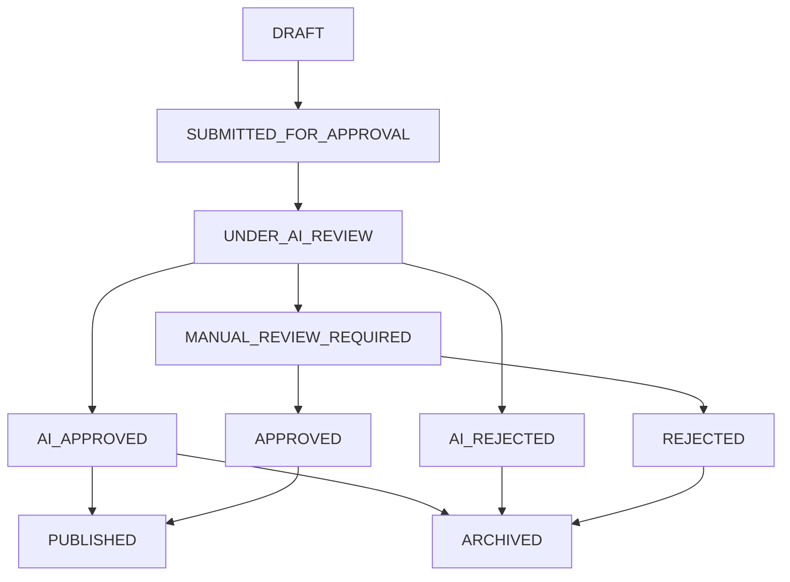

# 🤖 AIrTicle - AI-Powered Article Validation System

[](https://openjdk.java.net/)
[](https://spring.io/projects/spring-boot)
[](https://spring.io/projects/spring-ai)
[](https://postgresql.org/)

AIrTicle is a sophisticated AI-powered article validation and approval system built with **Java** and **Spring Boot**. It leverages **Spring AI** for seamless LLM integration to automate the content review process, providing intelligent analysis, detailed feedback, and automated approval decisions.

## 🌟 Features

### 🔍 **Intelligent Article Analysis**

- **Multi-Dimensional Evaluation**: Analyzes content quality, grammar, readability, originality, and SEO optimization
- **AI-Powered Scoring**: Uses advanced language models to provide comprehensive content assessment
- **Configurable Thresholds**: Customizable scoring criteria and approval thresholds

### ⚡ **Automated Workflow**

- **Asynchronous AI Analysis**: Articles are automatically submitted for AI analysis upon creation using `@Async` processing for non-blocking operations
- **Dual Analysis Modes**:
  - **Automatic**: Background AI analysis triggered on article creation
  - **Manual**: On-demand analysis via dedicated endpoint
- **Smart Decision Making**: Automatically classifies articles as `APPROVED`, `REJECTED`, or `REQUIRES_MANUAL_REVIEW`
- **Actionable Feedback**: Generates specific, AI-driven recommendations for content improvement
- **Audit Trail**: Complete history tracking of all analysis activities and status changes

### 🚀 **Modern Architecture**

- **RESTful API**: Clean, well-documented REST endpoints for all operations
- **Database Persistence**: Robust data storage with JPA/Hibernate integration
- **Async Processing**: Non-blocking AI analysis using `@Async` for optimal performance and fast response times
- **Relationship Management**: Proper entity relationships with circular reference protection
- **Dual Workflow**: Supports both automatic (background) and manual (on-demand) AI analysis

## 🏗️ Architecture Overview

### System Architecture

```
┌─────────────────┐    ┌──────────────────┐    ┌─────────────────┐
│   SvelteKit     │────│   Spring Boot    │────│   PostgreSQL    │
│   Frontend      │    │   REST API       │    │   Database      │
└─────────────────┘    └──────────────────┘    └─────────────────┘
         │                        │                        │
         │                        │                        │
         ▼                        ▼                        ▼
┌─────────────────┐    ┌──────────────────┐    ┌─────────────────┐
│   User Actions  │────│   AI Analysis    │────│   Data Storage  │
│   & Interface   │    │   Processing     │    │   & Retrieval   │
└─────────────────┘    └──────────────────┘    └─────────────────┘
```

### Frontend Architecture

```
┌─────────────────────────────────────────────────────────────────┐
│                        SvelteKit Frontend                       │
├─────────────────────────────────────────────────────────────────┤
│  ┌─────────────────┐  ┌─────────────────┐  ┌─────────────────┐  │
│  │     Routes      │  │   Components    │  │    Services     │  │
│  │                 │  │                 │  │                 │  │
│  │ • Dashboard     │  │ • UI Library    │  │ • API Client    │  │
│  │ • Articles      │  │ • Status Badge  │  │ • Type Safety   │  │
│  │ • Article Form  │  │ • Header/Nav    │  │ • Error Handler │  │
│  │ • Article View  │  │ • Cards/Buttons │  │ • Formatters    │  │
│  └─────────────────┘  └─────────────────┘  └─────────────────┘  │
├─────────────────────────────────────────────────────────────────┤
│  ┌─────────────────┐  ┌─────────────────┐  ┌─────────────────┐  │
│  │ Server Actions  │  │ Server Loading  │  │  State Mgmt     │  │
│  │                 │  │                 │  │                 │  │
│  │ • Form Submit   │  │ • SSR Data      │  │ • Svelte Runes  │  │
│  │ • AI Analysis   │  │ • API Fetching  │  │ • Reactive UI   │  │
│  │ • CRUD Ops      │  │ • Type Safety   │  │ • Client State  │  │
│  └─────────────────┘  └─────────────────┘  └─────────────────┘  │
├─────────────────────────────────────────────────────────────────┤
│                    Spring Boot REST API                         │
└─────────────────────────────────────────────────────────────────┘
```

### Key Frontend Features

- **Server-Side Rendering (SSR)**: Fast initial page loads with SEO optimization
- **Server Actions**: Type-safe form handling without JavaScript required
- **Svelte 5 Runes**: Modern reactive state management (`$state`, `$derived`, `$effect`)
- **Progressive Enhancement**: Works without JavaScript, enhanced with it
- **Type Safety**: End-to-end TypeScript with shared type definitions
- **Component Library**: Reusable UI components with consistent styling
- **Responsive Design**: Mobile-first design with TailwindCSS
- **Dark Mode**: Automatic theme switching with system preference detection

## 🔧 Technologies Used

### Backend Stack

- **Backend**: Java 21, Spring Boot 3.5.3
- **AI Integration**: Spring AI 1.0.0 (OpenAI/Groq compatible)
- **Database**: PostgreSQL with Spring Data JPA
- **Build Tool**: Maven
- **Additional**: Lombok, Jackson, Hibernate

### Frontend Stack

- **Framework**: SvelteKit 5 with Svelte 5 Runes
- **Language**: TypeScript
- **Styling**: TailwindCSS 4
- **UI Components**: shadcn-svelte, bits-ui
- **Icons**: Lucide Svelte
- **Build Tool**: Vite
- **Package Manager**: pnpm

## 📊 Database Schema

### Core Entities

#### 📝 **Articles**

```sql
CREATE TABLE articles (
    id UUID PRIMARY KEY,
    title VARCHAR NOT NULL,
    content TEXT NOT NULL,
    featured_image VARCHAR(500),
    status VARCHAR NOT NULL,
    is_published BOOLEAN DEFAULT FALSE,
    published_at TIMESTAMP,
    feedback TEXT,
    created_at TIMESTAMP NOT NULL,
    updated_at TIMESTAMP NOT NULL,
    rejected_at TIMESTAMP,
    rejected_by VARCHAR,
    approved_at TIMESTAMP,
    approved_by VARCHAR
);
```

#### 📈 **Analysis Results**

```sql
CREATE TABLE analyse_results (
    id UUID PRIMARY KEY,
    article_id UUID NOT NULL REFERENCES articles(id),
    decision VARCHAR NOT NULL,
    confidence_score DOUBLE NOT NULL,
    ai_analysis TEXT,
    recommendations TEXT,
    readability_score DOUBLE,
    grammar_score DOUBLE,
    seo_score DOUBLE,
    originality_score DOUBLE,
    analyzed_at TIMESTAMP NOT NULL,
    ai_model VARCHAR NOT NULL,
    processing_time_ms INTEGER
);
```

#### 📋 **Analysis History**

```sql
CREATE TABLE analyse_histories (
    id UUID PRIMARY KEY,
    article_id UUID NOT NULL REFERENCES articles(id),
    from_status VARCHAR,
    to_status VARCHAR,
    performed_by VARCHAR NOT NULL,
    reason TEXT,
    notes TEXT,
    metadata TEXT,
    confidence_score DOUBLE,
    ai_model VARCHAR,
    processing_time_ms INTEGER,
    created_at TIMESTAMP NOT NULL,
    updated_at TIMESTAMP NOT NULL
);
```

## 🚦 Article Status Flow



## 🛠️ Getting Started

### Prerequisites

- **Java 21+** - [Download here](https://openjdk.java.net/)
- **Maven 3.6+** - [Installation guide](https://maven.apache.org/install.html)
- **PostgreSQL 12+** - [Download here](https://www.postgresql.org/download/)
- **AI Provider API Key** - OpenAI, Groq, or compatible service

### 🔧 Installation & Setup

#### Backend Setup

1. **Clone the repository**

   ```bash
   git clone https://github.com/regisx001/AIrTicle.git
   cd AIrTicle
   ```

2. **Set up PostgreSQL Database**

   ```sql
   CREATE DATABASE approve_system;
   CREATE USER admin WITH PASSWORD 'admin123';
   GRANT ALL PRIVILEGES ON DATABASE approve_system TO admin;
   ```

3. **Configure Environment Variables**

   ```bash
   export GROQ_API_KEY="your_groq_api_key_here"
   export GROQ_BASE_URL="https://api.groq.com/openai/v1"
   export GROQ_MODEL="llama3-8b-8192"
   ```

4. **Update Application Configuration**
   Edit `src/main/resources/application.yaml`:

   ```yaml
   spring:
     datasource:
       url: jdbc:postgresql://localhost:5432/approve_system
       username: admin
       password: admin123
   ```

5. **Build and Run Backend**
   ```bash
   mvn clean install
   mvn spring-boot:run
   ```

#### Frontend Setup

1. **Navigate to frontend directory**

   ```bash
   cd frontend
   ```

2. **Install dependencies**

   ```bash
   pnpm install
   ```

3. **Configure environment variables**
   Create `.env` file:

   ```bash
   PUBLIC_API_URL=http://localhost:8080/api
   ```

4. **Start development server**

   ```bash
   pnpm dev
   ```

#### Quick Start (Both Services)

Use the provided automation script:

```bash
chmod +x start-dev.sh
./start-dev.sh
```

This script will:

- Start the Spring Boot backend on `http://localhost:8080`
- Start the SvelteKit frontend on `http://localhost:5173`
- Open both in separate terminal tabs for easy monitoring

**Application URLs:**

- Frontend: `http://localhost:5173`
- Backend API: `http://localhost:8080`
- API Documentation: `http://localhost:8080/swagger-ui.html` (if enabled)

## �️ Frontend Interface & Screenshots

### 🏠 **Dashboard Page**

_Main landing page with article overview and statistics_

```
┌─────────────────────────────────────────────────────────────────┐
│  AIrTicle                                    [🌙] [Create Article] │
├─────────────────────────────────────────────────────────────────┤
│                                                                 │
│  📊 Dashboard Overview                                          │
│                                                                 │
│  ┌─────────────┐ ┌─────────────┐ ┌─────────────┐ ┌─────────────┐ │
│  │   Total     │ │  Approved   │ │  Pending    │ │  Rejected   │ │
│  │ Articles    │ │  Articles   │ │  Review     │ │  Articles   │ │
│  │    125      │ │     89      │ │     23      │ │     13      │ │
│  └─────────────┘ └─────────────┘ └─────────────┘ └─────────────┘ │
│                                                                 │
│  📝 Recent Articles                              [View All] →   │
│                                                                 │
│  ┌─────────────────────────────────────────────────────────────┐ │
│  │ [✅] The Future of AI in Content Creation     July 30, 2025 │ │
│  │      Content quality analysis with high confidence...       │ │
│  │      👤 regisx001 • 📊 Score: 9.2/10 • 🏷️ AI_APPROVED      │ │
│  └─────────────────────────────────────────────────────────────┘ │
│                                                                 │
│  ┌─────────────────────────────────────────────────────────────┐ │
│  │ [⏳] Machine Learning Best Practices         July 29, 2025 │ │
│  │      AI analysis in progress for quality review...          │ │
│  │      👤 johndoe • 🤖 UNDER_AI_REVIEW                        │ │
│  └─────────────────────────────────────────────────────────────┘ │
│                                                                 │
└─────────────────────────────────────────────────────────────────┘
```

**Key Features:**

- **Statistics Overview**: Quick metrics on article status distribution
- **Recent Articles**: Latest submissions with status indicators
- **Status Badges**: Color-coded visual indicators for article states
- **Quick Actions**: Direct navigation to article management and creation

---

### 📑 **Articles Management Page**

_Complete article listing with search, filter, and pagination_

```
┌─────────────────────────────────────────────────────────────────┐
│  ← Back to Dashboard                          [Create Article]   │
├─────────────────────────────────────────────────────────────────┤
│                                                                 │
│  �📚 Articles Management                                         │
│                                                                 │
│  🔍 [Search articles...                    ] [🔽 All Statuses] │
│                                                                 │
│  ┌─────────────────────────────────────────────────────────────┐ │
│  │ [✅] Advanced React Patterns                              │ │
│  │      A comprehensive guide to advanced React patterns...   │ │
│  │      ────────────────────────────────────────────────────── │ │
│  │      📊 Score: 8.9/10 • 📅 July 30, 2025 • 👤 regisx001   │ │
│  │      🏷️ APPROVED • 📄 1,247 words                         │ │
│  │                                          [View] [Edit]     │ │
│  └─────────────────────────────────────────────────────────────┘ │
│                                                                 │
│  ┌─────────────────────────────────────────────────────────────┐ │
│  │ [⚠️] Content Strategy for 2025                            │ │
│  │      Modern approaches to content marketing and...         │ │
│  │      ────────────────────────────────────────────────────── │ │
│  │      📊 Score: 6.2/10 • 📅 July 29, 2025 • 👤 sarah_w     │ │
│  │      🏷️ MANUAL_REVIEW_REQUIRED • 📄 892 words             │ │
│  │                                          [View] [Edit]     │ │
│  └─────────────────────────────────────────────────────────────┘ │
│                                                                 │
│  ┌─────────────────────────────────────────────────────────────┐ │
│  │ [❌] Outdated SEO Techniques                               │ │
│  │      Discussion of SEO methods that are no longer...       │ │
│  │      ────────────────────────────────────────────────────── │ │
│  │      📊 Score: 3.1/10 • 📅 July 28, 2025 • 👤 mike_123    │ │
│  │      🏷️ AI_REJECTED • 📄 534 words                        │ │
│  │                                          [View] [Edit]     │ │
│  └─────────────────────────────────────────────────────────────┘ │
│                                                                 │
│  ← Previous   Page 1 of 8   Next →                             │
│                                                                 │
└─────────────────────────────────────────────────────────────────┘
```

**Key Features:**

- **Search & Filter**: Real-time search with status filtering
- **Article Cards**: Rich preview with metadata and actions
- **Pagination**: Efficient navigation through large article sets
- **Status Indicators**: Visual status badges with score information
- **Quick Actions**: Direct access to view and edit functionality

---

### ✍️ **Article Creation Page**

_Comprehensive article creation form with live preview and AI analysis_

```
┌─────────────────────────────────────────────────────────────────┐
│  ← Back to Articles                                              │
├─────────────────────────────────────────────────────────────────┤
│                                                                 │
│  ✏️ Create New Article                                          │
│  Write your article and let AI analyze its quality, grammar,    │
│  and SEO optimization                                           │
│                                                                 │
│  ┌─────────────────────────────┐  ┌─────────────────────────────┐ │
│  │ Article Title *             │  │ Featured Image URL          │ │
│  │ [The Future of AI in Con... ]  │ [https://example.com/...  ] │ │
│  │                             │  │                             │ │
│  │ Article Content *           │  │ ┌─────────────────────────┐ │ │
│  │ ┌─────────────────────────┐ │  │ │                         │ │ │
│  │ │ Artificial intelligence │ │  │ │    [Featured Image      │ │ │
│  │ │ is revolutionizing how  │ │  │ │     Preview]            │ │ │
│  │ │ we create, review, and  │ │  │ │                         │ │ │
│  │ │ optimize content...     │ │  │ └─────────────────────────┘ │ │
│  │ │                         │ │  │                             │ │
│  │ │ [Continue writing...]   │ │  │ 🤖 AI Analysis             │ │
│  │ │                         │ │  │ ✓ Content Quality & Struct  │ │
│  │ │                         │ │  │ ✓ Grammar & Readability     │ │
│  │ │                         │ │  │ ✓ SEO Optimization          │ │
│  │ │                         │ │  │ ✓ Originality Assessment    │ │
│  │ │                      [👁️ Preview] │                         │ │
│  │ └─────────────────────────┘ │  │ Analysis starts automatically│ │
│  │ 247 words                   │  │ after submission            │ │
│  │                             │  │                             │ │
│  └─────────────────────────────┘  │ 💡 Writing Tips             │ │
│                                    │ • Use clear headings        │ │
│  ────────────────────────────────  │ • Write in active voice     │ │
│  ✅ Ready to submit for AI analysis │ • Include keywords naturally│ │
│                                    │ • Keep paragraphs concise   │ │
│                      [💾 Create & Analyze Article] │ • Proofread before submit │ │
│                                    └─────────────────────────────┘ │
└─────────────────────────────────────────────────────────────────┘
```

**Key Features:**

- **Real-time Validation**: Live word count and form validation
- **Preview Mode**: Toggle between edit and preview views
- **AI Analysis Preview**: Information about what will be analyzed
- **Writing Guidelines**: Helpful tips for better content creation
- **Image Preview**: Live preview of featured images
- **Form State Management**: Preserves content during navigation

---

### 👁️ **Article Detail View**

_Comprehensive article view with AI analysis results and history_

```
┌─────────────────────────────────────────────────────────────────┐
│  ← Back to Articles                                    [Edit]    │
├─────────────────────────────────────────────────────────────────┤
│                                                                 │
│  🎯 The Future of AI in Content Creation          [✅ APPROVED] │
│  Published on July 30, 2025 by regisx001                       │
│                                                                 │
│  ┌─────────────────────────────┐  ┌─────────────────────────────┐ │
│  │                             │  │ 📊 AI Analysis Results      │ │
│  │  [Featured Image]           │  │                             │ │
│  │                             │  │ Overall Score: 9.2/10       │ │
│  │                             │  │ Confidence: 92%             │ │
│  │                             │  │                             │ │
│  │ Artificial intelligence is  │  │ ┌─────────────────────────┐ │ │
│  │ revolutionizing how we      │  │ │ 📝 Content Quality: 9.1 │ │ │
│  │ create, review, and optimize│  │ │ ✏️ Grammar Score: 9.5    │ │ │
│  │ content. In this comprehensive│ │ │ 🔍 SEO Score: 8.8       │ │ │
│  │ guide, we'll explore the    │  │ │ 🎯 Originality: 9.0     │ │ │
│  │ latest developments in AI   │  │ └─────────────────────────┘ │ │
│  │ content creation and how    │  │                             │ │
│  │ it's transforming the       │  │ 💡 AI Recommendations       │ │
│  │ digital landscape...        │  │                             │ │
│  │                             │  │ "Excellent article structure│ │
│  │ [Full article content       │  │ with clear headings and     │ │
│  │  continues...]              │  │ engaging content. Consider  │ │
│  │                             │  │ adding more specific        │ │
│  │                             │  │ examples in section 3..."   │ │
│  │                             │  │                             │ │
│  │                             │  │ 📅 Analysis Details         │ │
│  │                             │  │ • Model: llama3-8b-8192     │ │
│  │                             │  │ • Processing: 2.34s         │ │
│  │                             │  │ • Analyzed: July 30, 2025   │ │
│  │                             │  │                             │ │
│  │ Word Count: 1,247 words     │  │ 📚 Analysis History         │ │
│  │ Reading Time: ~5 minutes    │  │                             │ │
│  │                             │  │ ● DRAFT → APPROVED          │ │
│  │                             │  │   "Article meets all quality│ │
│  │                             │  │   standards..."             │ │
│  │                             │  │   July 30, 2025 by AI      │ │
│  │                             │  │                             │ │
│  └─────────────────────────────┘  └─────────────────────────────┘ │
│                                                                 │
└─────────────────────────────────────────────────────────────────┘
```

**Key Features:**

- **Full Article Display**: Clean, readable article presentation
- **AI Analysis Results**: Detailed scoring breakdown and recommendations
- **Analysis History**: Complete audit trail of status changes
- **Metadata Display**: Article statistics and publication information
- **Action Buttons**: Easy access to editing and navigation
- **Responsive Layout**: Optimized for both desktop and mobile viewing

---

### 🎨 **Design System & Components**

#### Status Indicators

- **🟢 APPROVED**: Green badge with checkmark
- **🟡 PENDING/UNDER_REVIEW**: Yellow badge with clock icon
- **🟠 MANUAL_REVIEW_REQUIRED**: Orange badge with warning icon
- **🔴 REJECTED**: Red badge with X icon
- **⚪ DRAFT**: Gray badge with pencil icon

#### Theme Support

- **🌞 Light Mode**: Clean, professional white interface
- **🌙 Dark Mode**: Easy-on-eyes dark interface with proper contrast
- **🔄 System Sync**: Automatic theme switching based on OS preference

#### Interactive Elements

- **Hover Effects**: Subtle animations and state changes
- **Loading States**: Spinner animations during async operations
- **Form Validation**: Real-time feedback with visual indicators
- **Responsive Design**: Seamless experience across all device sizes

## 📚 API Documentation

### Frontend API Integration

The SvelteKit frontend integrates seamlessly with the Spring Boot backend through:

#### Type-Safe API Client (`lib/api.ts`)

```typescript
// Centralized API client with error handling
export const api = {
  async getArticles(params?: ArticleParams): Promise<PageResponse<Article>> {
    const url = new URL(`${API_BASE_URL}/articles`);
    if (params) {
      Object.entries(params).forEach(([key, value]) => {
        if (value !== undefined) url.searchParams.set(key, value.toString());
      });
    }

    const response = await fetch(url.toString());
    if (!response.ok) throw new Error(`HTTP ${response.status}`);
    return response.json();
  },

  async createArticle(article: CreateArticleRequest): Promise<Article> {
    const response = await fetch(`${API_BASE_URL}/articles`, {
      method: "POST",
      headers: { "Content-Type": "application/json" },
      body: JSON.stringify(article),
    });

    if (!response.ok) throw new Error(`HTTP ${response.status}`);
    return response.json();
  },
  // ... more methods
};
```

#### Server Actions (Form Handling)

```typescript
// Type-safe server actions for form processing
export const actions: Actions = {
  create: async ({ request }) => {
    const data = await request.formData();
    const article = {
      title: data.get("title") as string,
      content: data.get("content") as string,
      featuredImage: data.get("featuredImage") as string,
    };

    try {
      const result = await api.createArticle(article);
      throw redirect(302, `/articles/${result.id}`);
    } catch (error) {
      return fail(400, { error: "Failed to create article" });
    }
  },
};
```

#### Server-Side Data Loading

```typescript
// SSR data loading with type safety
export const load: PageServerLoad = async ({ params, url }) => {
  const page = parseInt(url.searchParams.get("page") || "0");
  const size = parseInt(url.searchParams.get("size") || "10");

  try {
    const [articles, analysis, history] = await Promise.all([
      api.getArticles({ page, size }),
      api.getAnalysisResult(params.id),
      api.getAnalysisHistory(params.id),
    ]);

    return { articles, analysis, history };
  } catch (error) {
    throw error(404, "Article not found");
  }
};
```

### 📝 **Article Management**

#### Create Article (with Automatic AI Analysis)

```http
POST /api/articles
Content-Type: application/json

{
  "title": "The Future of AI in Content Creation",
  "content": "Artificial intelligence is revolutionizing how we create, review, and optimize content...",
  "featuredImage": "https://example.com/image.jpg"
}
```

**Response (Immediate):**

```json
{
  "id": "123e4567-e89b-12d3-a456-426614174000",
  "title": "The Future of AI in Content Creation",
  "content": "Artificial intelligence is revolutionizing...",
  "status": "DRAFT",
  "isPublished": false,
  "createdAt": "2025-07-30T10:00:00",
  "updatedAt": "2025-07-30T10:00:00"
}
```

> **Note**: AI analysis starts automatically in the background using `@Async` processing. The article status will update once analysis completes.

#### Get All Articles (Paginated)

```http
GET /api/articles?page=0&size=10&sort=createdAt,desc
```

**Response:**

```json
{
  "content": [
    {
      "id": "123e4567-e89b-12d3-a456-426614174000",
      "title": "The Future of AI in Content Creation",
      "status": "APPROVED",
      "isPublished": false,
      "createdAt": "2025-07-30T10:00:00",
      "updatedAt": "2025-07-30T10:05:00"
    }
  ],
  "pageable": {
    "pageNumber": 0,
    "pageSize": 10
  },
  "totalElements": 1,
  "totalPages": 1
}
```

#### Get Single Article

```http
GET /api/articles/{articleId}
```

**Response:**

```json
{
  "id": "123e4567-e89b-12d3-a456-426614174000",
  "title": "The Future of AI in Content Creation",
  "content": "Full article content...",
  "featuredImage": "https://example.com/image.jpg",
  "status": "APPROVED",
  "isPublished": false,
  "feedback": "Article demonstrates excellent quality...",
  "createdAt": "2025-07-30T10:00:00",
  "updatedAt": "2025-07-30T10:05:00",
  "approvedAt": "2025-07-30T10:05:00",
  "approvedBy": "AI System"
}
```

### 🤖 **AI Analysis**

#### Manual Article Review (On-Demand)

```http
POST /api/articles/{articleId}/review
```

**Response:**

```json
{
  "id": "456e7890-e89b-12d3-a456-426614174000",
  "decision": "APPROVED",
  "confidenceScore": 0.92,
  "aiAnalysis": "This article demonstrates excellent writing quality with clear structure and engaging content...",
  "recommendations": "Consider adding more specific examples in section 3 to enhance reader engagement...",
  "readabilityScore": 8.5,
  "grammarScore": 9.2,
  "seoScore": 7.8,
  "originalityScore": 9.1,
  "analyzedAt": "2025-07-30T10:05:00",
  "aiModel": "llama3-8b-8192",
  "processingTimeMs": 2340
}
```

> **Use Case**: Trigger manual analysis for articles that need re-evaluation or for testing purposes.

#### Get Latest Analysis Result

```http
GET /api/articles/{articleId}/review
```

**Response:**

```json
{
  "id": "456e7890-e89b-12d3-a456-426614174000",
  "articleId": "123e4567-e89b-12d3-a456-426614174000",
  "decision": "APPROVED",
  "confidenceScore": 0.92,
  "aiAnalysis": "Comprehensive analysis results...",
  "recommendations": "Improvement suggestions...",
  "readabilityScore": 8.5,
  "grammarScore": 9.2,
  "seoScore": 7.8,
  "originalityScore": 9.1,
  "analyzedAt": "2025-07-30T10:05:00",
  "aiModel": "llama3-8b-8192",
  "processingTimeMs": 2340
}
```

### 📊 **History & Tracking**

#### Get Article Analysis History

```http
GET /api/articles/{articleId}/history
```

**Response:**

```json
[
  {
    "id": "789e0123-e89b-12d3-a456-426614174000",
    "articleId": "123e4567-e89b-12d3-a456-426614174000",
    "fromStatus": "DRAFT",
    "toStatus": "APPROVED",
    "performedBy": "AI System",
    "reason": "Article meets all quality standards with high confidence score",
    "notes": "Excellent content structure and originality",
    "confidenceScore": 0.92,
    "aiModel": "llama3-8b-8192",
    "processingTimeMs": 2340,
    "createdAt": "2025-07-30T10:05:00",
    "updatedAt": "2025-07-30T10:05:00"
  },
  {
    "id": "456e7890-e89b-12d3-a456-426614174001",
    "articleId": "123e4567-e89b-12d3-a456-426614174000",
    "fromStatus": null,
    "toStatus": "DRAFT",
    "performedBy": "user123",
    "reason": "Article created",
    "notes": "Initial article submission",
    "createdAt": "2025-07-30T10:00:00",
    "updatedAt": "2025-07-30T10:00:00"
  }
]
```

## 🔄 **Analysis Workflow**

### Automatic Analysis (Default)

1. **Article Creation** → Immediate response with `DRAFT` status
2. **Background Processing** → `@Async` AI analysis starts automatically
3. **Status Update** → Article status changes to `APPROVED`, `REJECTED`, or `MANUAL_REVIEW_REQUIRED`
4. **History Logging** → Analysis results and status changes are recorded

### Manual Analysis (On-Demand)

1. **Trigger Review** → `POST /api/articles/{id}/review`
2. **Synchronous Processing** → Immediate AI analysis
3. **Direct Response** → Analysis results returned immediately
4. **Status Update** → Article status updated based on results

## 📋 **Complete API Reference**

| Method | Endpoint                     | Description                                  | Response Type          |
| ------ | ---------------------------- | -------------------------------------------- | ---------------------- |
| `GET`  | `/api/articles`              | Get paginated list of articles               | `Page<Article>`        |
| `GET`  | `/api/articles/{id}`         | Get single article by ID                     | `Article`              |
| `POST` | `/api/articles`              | Create new article (triggers async analysis) | `Article`              |
| `POST` | `/api/articles/{id}/review`  | Manual AI analysis (synchronous)             | `AnalyseResult`        |
| `GET`  | `/api/articles/{id}/review`  | Get latest analysis result                   | `AnalyseResult`        |
| `GET`  | `/api/articles/{id}/history` | Get article analysis history                 | `List<AnalyseHistory>` |

## ⚙️ Configuration

### AI Analysis Settings

The system uses configurable parameters for analysis (see `AIAnalysisConfig`):

```java
@ConfigurationProperties(prefix = "ai.analysis")
public class AIAnalysisConfig {
    private int minWordCount = 100;
    private int maxWordCount = 5000;
    private double autoApprovalThreshold = 0.8;
    private double autoRejectionThreshold = 0.4;
    private double contentQualityWeight = 0.3;
    private double grammarWeight = 0.25;
    private double originalityWeight = 0.25;
    private double seoWeight = 0.2;
}
```

### Custom Configuration Example

```yaml
ai:
  analysis:
    min-word-count: 150
    max-word-count: 4000
    auto-approval-threshold: 0.85
    auto-rejection-threshold: 0.35
    content-quality-weight: 0.35
    grammar-weight: 0.25
    originality-weight: 0.25
    seo-weight: 0.15
```

## 🔍 Analysis Criteria

The AI evaluation considers multiple factors:

### 📊 **Scoring Metrics**

1. **Content Quality (30%)**: Relevance, depth, structure, and engagement
2. **Grammar (25%)**: Language correctness, syntax, and readability
3. **Originality (25%)**: Uniqueness and plagiarism detection
4. **SEO Optimization (20%)**: Meta information, keyword usage, and structure

### 🎯 **Decision Logic**

- **Score ≥ 0.8**: ✅ **AUTO_APPROVED**
- **Score ≤ 0.4**: ❌ **AUTO_REJECTED**
- **0.4 < Score < 0.8**: 👤 **MANUAL_REVIEW_REQUIRED**

## 🧪 Testing

### Run Tests

```bash
mvn test
```

### Example Test Cases

```bash
# Test article creation (triggers automatic async AI analysis)
curl -X POST http://localhost:8080/api/articles \
  -H "Content-Type: application/json" \
  -d '{"title":"Test Article","content":"This is a test article content with sufficient length to meet minimum requirements for analysis. The content should be comprehensive enough to trigger meaningful AI analysis and provide valuable feedback for content improvement."}'

# Check article status after creation (may still be DRAFT if analysis is ongoing)
curl -X GET http://localhost:8080/api/articles/{articleId}

# Trigger manual AI analysis (synchronous)
curl -X POST http://localhost:8080/api/articles/{articleId}/review

# Get latest analysis results
curl -X GET http://localhost:8080/api/articles/{articleId}/review

# Get complete analysis history
curl -X GET http://localhost:8080/api/articles/{articleId}/history

# Get paginated articles list
curl -X GET "http://localhost:8080/api/articles?page=0&size=5&sort=createdAt,desc"
```

### Testing Workflow

1. **Create Article**: Returns immediately with `DRAFT` status
2. **Wait for Analysis**: Background processing completes (typically 2-5 seconds)
3. **Check Status**: Article status updates to final decision
4. **Review Results**: Get detailed analysis and recommendations
5. **Track History**: View complete audit trail

## 🤝 Contributing

1. Fork the repository
2. Create your feature branch (`git checkout -b feature/amazing-feature`)
3. Commit your changes (`git commit -m 'Add some amazing feature'`)
4. Push to the branch (`git push origin feature/amazing-feature`)
5. Open a Pull Request

## 📝 License

This project is licensed under the MIT License - see the [LICENSE](LICENSE) file for details.

## 👥 Authors

- **regisx001** - _Initial work_ - [GitHub](https://github.com/regisx001)

## 🙏 Acknowledgments

- Spring AI team for excellent LLM integration
- OpenAI/Groq for providing powerful language models
- Spring Boot community for robust framework support

---

**AIrTicle** - Revolutionizing content validation with AI-powered intelligence! 🚀
